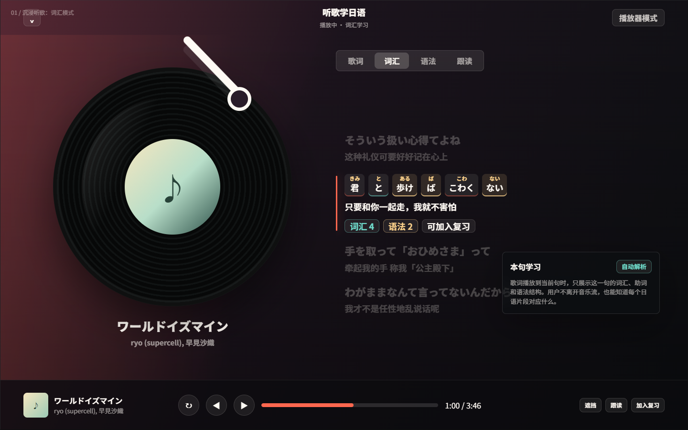
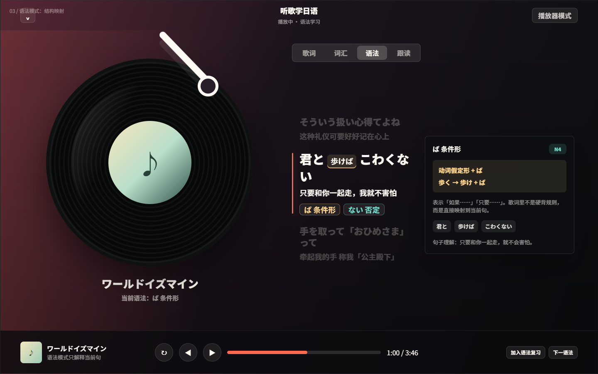
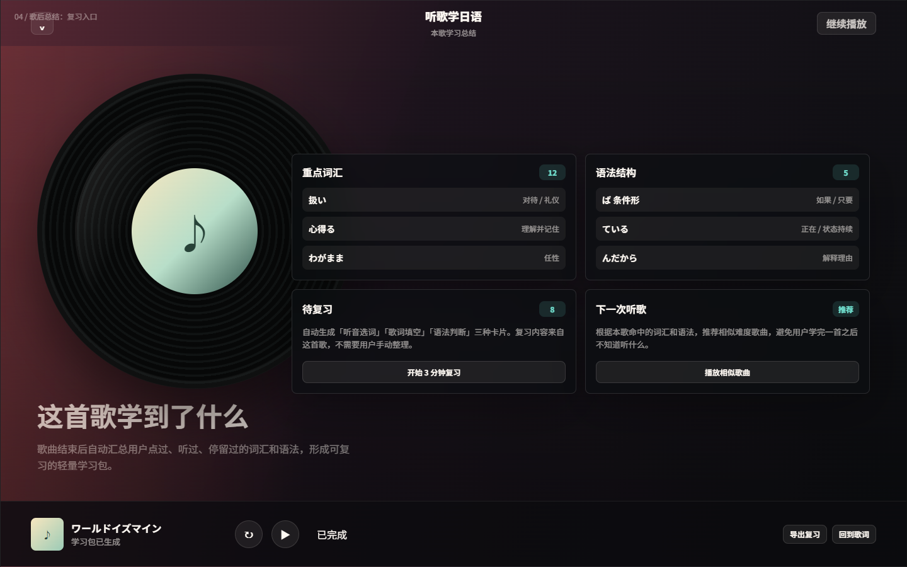

# 听歌学日语设计稿

这份设计稿解决一个核心问题：只显示中日歌词，用户仍然不知道每个日语词、助词、语法结构分别是什么意思。

设计原则：

- 歌词仍然是主角，学习信息只围绕当前播放句出现。
- 单词、助词、语法都要和日语原文建立位置关系。
- 不把沉浸页做成教材页，所有解释都要轻、短、可收起。
- 用户操作以点击词、点击语法、加入复习为主，不打断播放。

## 产品形态

### 1. 沉浸听歌：词汇模式

当前播放句会被切成词块。词块上方显示假名，词块下方用颜色区分：

- 普通词汇：轻背景。
- 助词：青绿色下划线。
- 语法结构：金色下划线。

用户可以一边听歌一边知道「哪个日语片段对应哪个中文意思」。

### 2. 点词学习：词义浮层

点击当前句中的词块后，在歌词旁边弹出轻量解释：

- 原形
- 读音
- 词性
- 本句意思
- 加入复习

浮层只解释当前词，不抢占整页空间。

### 3. 语法模式：结构映射

语法模式不展示全部语法书内容，只解释当前句命中的结构。

示例：

- `歩けば` 标为 `ば 条件形`
- 公式：`歩く → 歩け + ば`
- 句子映射：`君と / 歩けば / こわくない`
- 中文理解：只要和你一起走，就不会害怕。

### 4. 歌后总结：复习入口

歌曲结束后自动汇总本歌的学习资产：

- 重点词汇
- 语法结构
- 待复习卡片
- 相似歌曲推荐

用户不用手动整理，也能把一首歌变成复习材料。

## MVP 实现建议

第一阶段：

- 当前句分词。
- 当前句词块可点击。
- 词义浮层。
- 语法结构高亮。
- 加入复习。

第二阶段：

- 跟读模式。
- 遮挡译文模式。
- 单句循环学习。
- 歌曲结束学习总结。

第三阶段：

- 根据歌曲难度推荐下一首。
- 统计每首歌学到的词汇和语法。
- 复习库按歌曲来源筛选。

## 技术建议

- 分词：先复用现有 `kuromoji`/词法分析能力。
- 语法规则：先用规则匹配 MVP，比如 `ば`、`ない`、`ている`、`んだから`、`ても`、`たい`、`こと`。
- 数据结构：给每个歌词行增加 `tokens` 和 `grammarHits`。
- UI 交互：沉浸页只展示当前句学习信息，首页列表仍保持浏览和播放效率。
